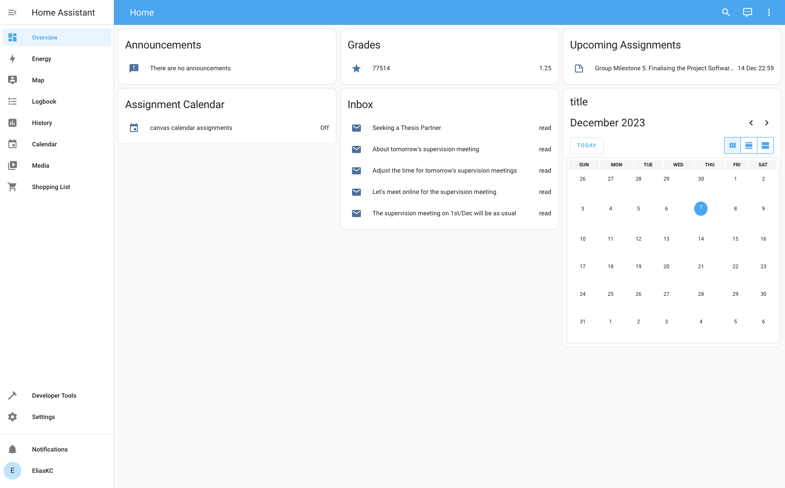

The Canvas integrations allows you to get an overview of your courses, including assignments, announcements, grades, and more.

- [Configuration](#configuration)
  - [Personal Access Token](#personal-access-token)
- [Adding the Services](#adding-the-services)
  - [Sensors](#sensors)
  - [Assignments Calendar](#assignments-calendar)
  - [Quick Links](#quick-links)



## Configuration

1. Browse to your Home Assistant instance.
2. Go to [Settings > Devices & Services](https://my.home-assistant.io/redirect/integrations).
3. In the bottom right corner, select the [**⊕ Add Integration**](https://my.home-assistant.io/redirect/config_flow_start?domain=instructure) button.
4. From the list, select **Canvas**.
5. Follow the instructions on screen to complete the setup.

The host should be without the domain extension, e.g **`chalmers`** and not **`chalmers.se`**.

### Personal Access Token

Your personal access token can be generated in **Canvas > Account > Settings > Approved integrations** by clicking the **⊕ New access token**.

 `https://{host}.instructure.com/profile/settings`

## Adding the Services

### Sensors

To add one of the assignments, announcements, inbox, or grades sensors to your dashboard, navigate to the integration in [**Settings > Devices & Services**](https://my.home-assistant.io/redirect/integrations) and click on **Services**. In the table of services, click on the one you want to add, and press **Add to dashboard**.

### Assignments Calendar

To add the assignments calendar, go to your dashboard, click on the three dots in the top right and select **Edit dashboard**. Then, click on **Add card** in the bottom right and select the **Calendar**. Here, choose **`canvas calendar assignments`** as the entity and press **Save**

### Quick Links

To add quick links to your dashboard, create a `canvas.yaml` file in your Home Assistant config/ folder. Example quick link configuration:

```yaml
quick_links:
  - name:  'Course Schedule'
    url: 'https://chalmers.instructure.com/courses/25271/pages/course-schedule?module_item_id=386861'
  - name:  'Link 2'
    url: '{Link 2}'
```
